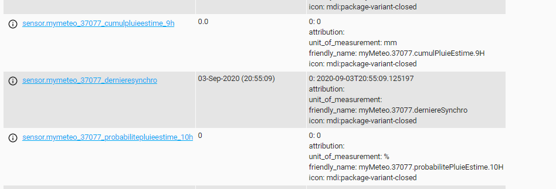

# apimetconcept


cet api permet de ce connecter à api.meteo-concept.com et recuperer des informations telque la prevision de la nuit à venir

pour l'utiliser, il suffit d'ajouter le sensor suivant : 

```yaml
- platform: apiMeteoConcept
  code: <code INSEE de la ville>
  token: <votre token>
```
la creation du token se fait ici : https://api.meteo-concept.com/

pour le moment implementation de la prevision pluie( quantité et pourcentage ) sur les 12 prochaines heures



